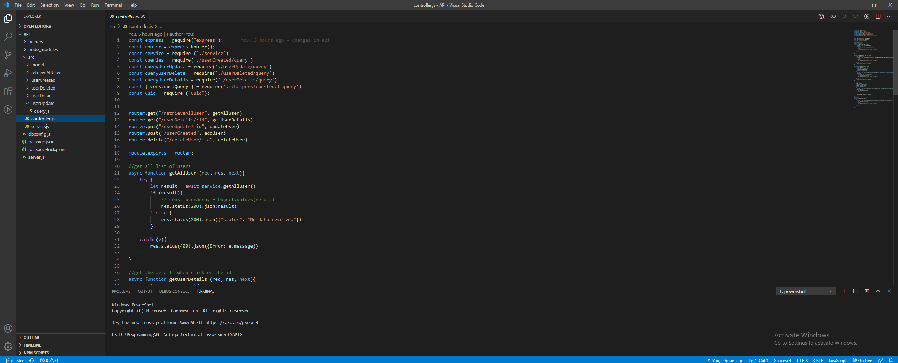
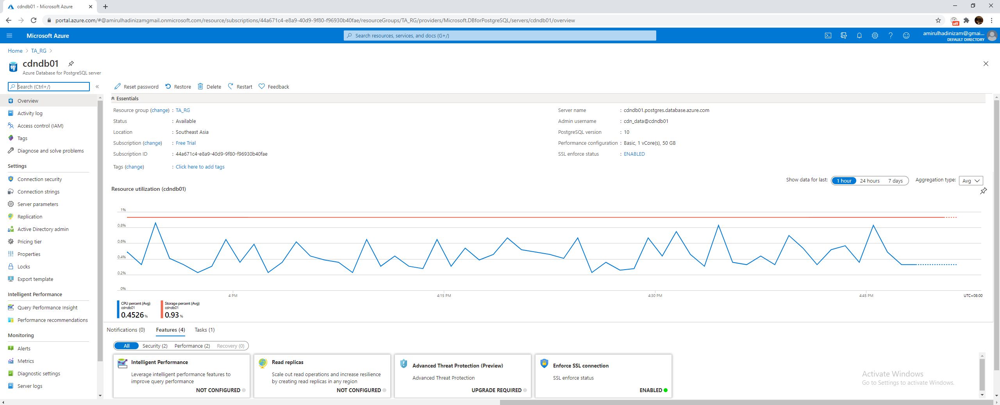
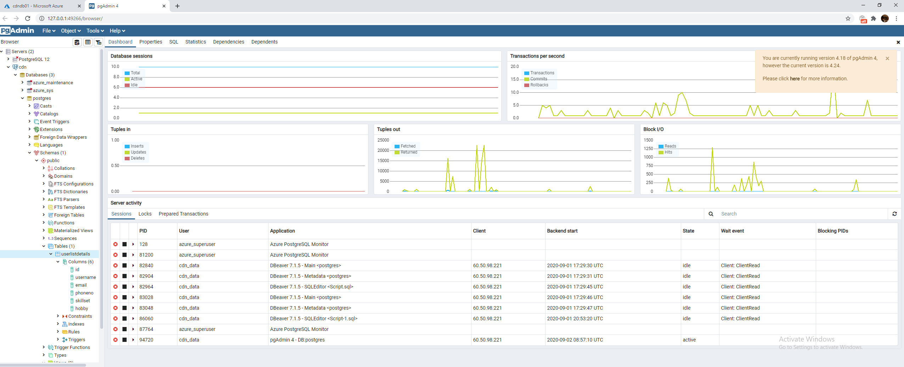
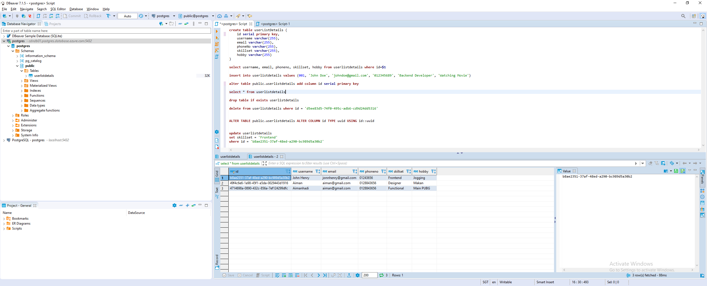
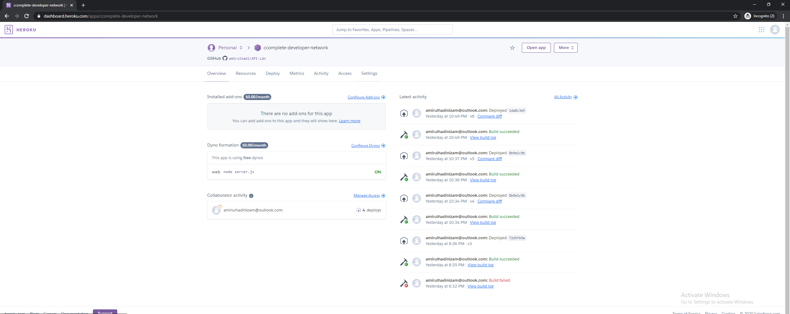

# Complete Developer Network (CDN) - API
Simple app created with Node.js, and PostgreSql integrating with Angular in the frontend.
Can refer to https://github.com/amirulhadi/frontend for Frontend repository.

## Table of contents
* [General info](#general-info)
* [Technologies](#technologies)
* [Setup](#setup)
* [Demo](#demo)

## General Info
This project is a a fictional company, CDN - Complete Developer Network is going to build a list of freelancers.
such that they could have a directory of contact get people for their job. The API works to retrieve and post data to database from the input and to the frontend.


## Technologies
Project is created with:
* Angular 
* Node JS
* PostgreSQL
* Azure PostgreSQL Server
* Postman
* DBeaver
* Visual Studio Code
* Heroku

## Setup
### Back-End
- Developed the back-end development by using Node JS Framework
- Implement the RESTful API which involving GET, PUT, POST and DELETE
- Enable the cors for cross domain request and applying the cors in server.js
  ```
  app.use(function(req, res, next) {
    res.header("Access-Control-Allow-Origin", "*"); // update to match the domain you will make the request from
    res.header("Access-Control-Allow-Headers", "Origin, X-Requested-With, Content-Type, Accept");
    res.header("Access-Control-Allow-Methods", "GET,POST,PUT,DELETE,OPTIONS")
    next();
  });
  ```



### Database
Creating the server in Azure PostgreSQL
- Creating the new resource group to contain the Azure PostgreSQL Server 
- Copy the server information and pass to pgAdmin and DBeaver to connect the server and database



Create the connection in pgAdmin 



Connect the connection in DBeaver



### Postman
The development is also tested by using Postman to validate the required data to be pass in and pass out from request and response. The data is validated through
JSON data format.
May refer to the Postman Collection for all the method in the API.

### Hosted
- The API is hosted in Heroku 
- Required to create a new file called "Procfile" to declared the commands to run the api
  The command is:
  ```
  node: server.js
  ```
  Then build and deploy
  



## Demo
https://cdntechnology.netlify.app

